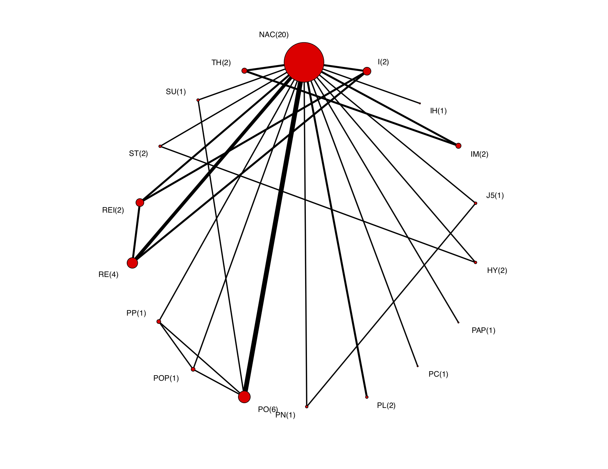

I am currently working on modeling the contribution of each study used in the network meta-analysis (NMA) to each pair of treatments comparisons. Below is a network plot of swine vaccine treatments. The numbers in the brackets are the number of studies containing that treatment.
